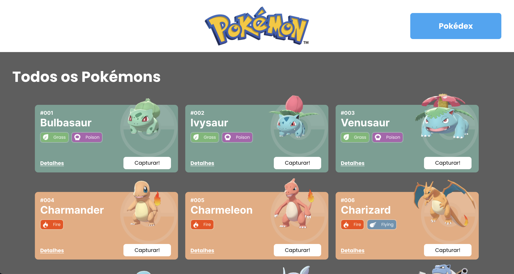
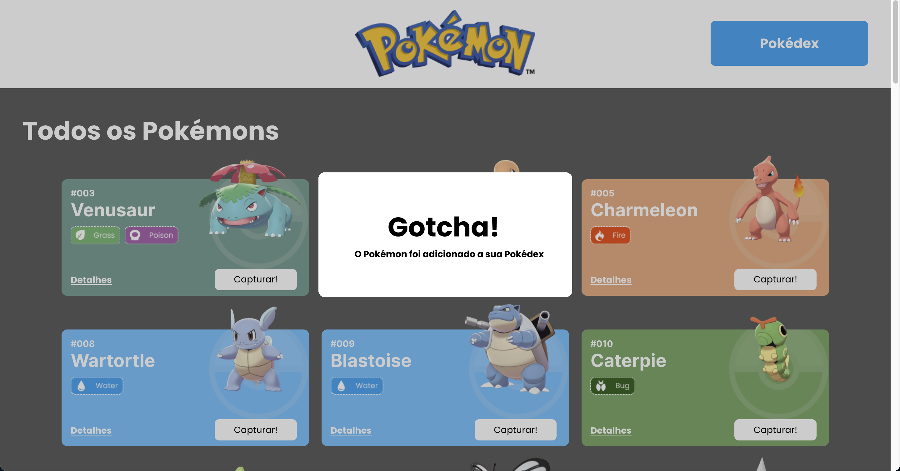
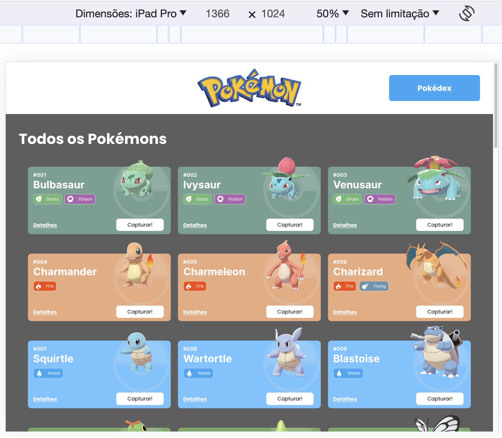
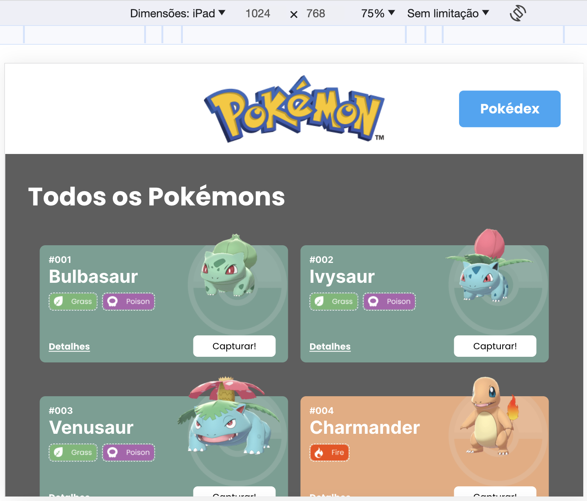
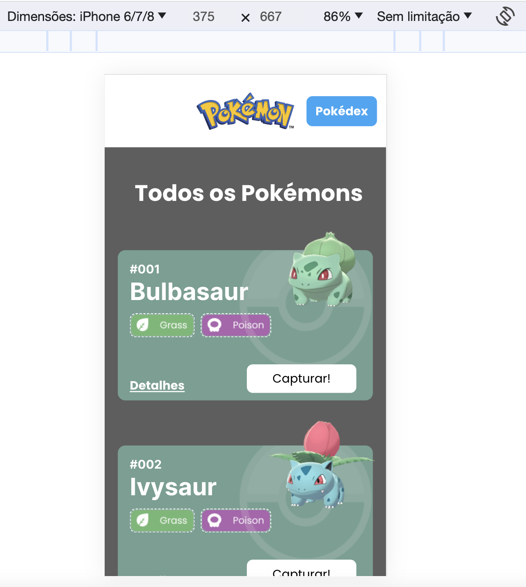
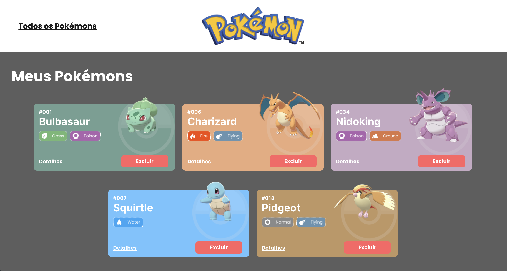
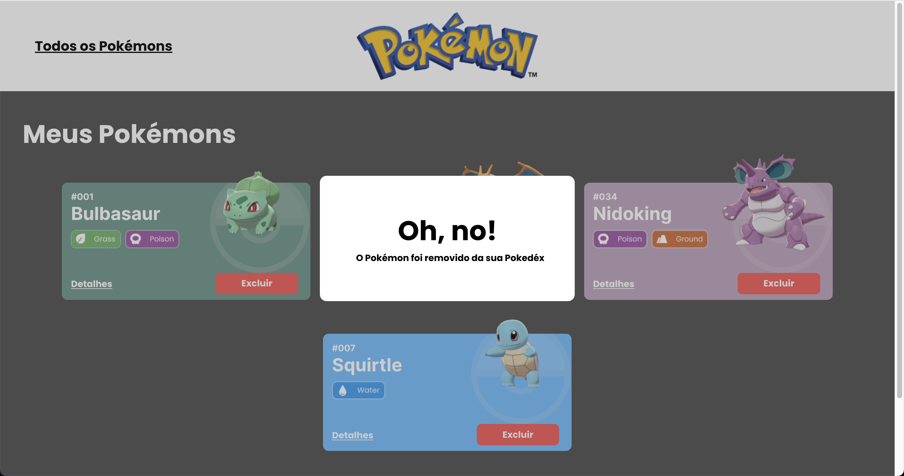
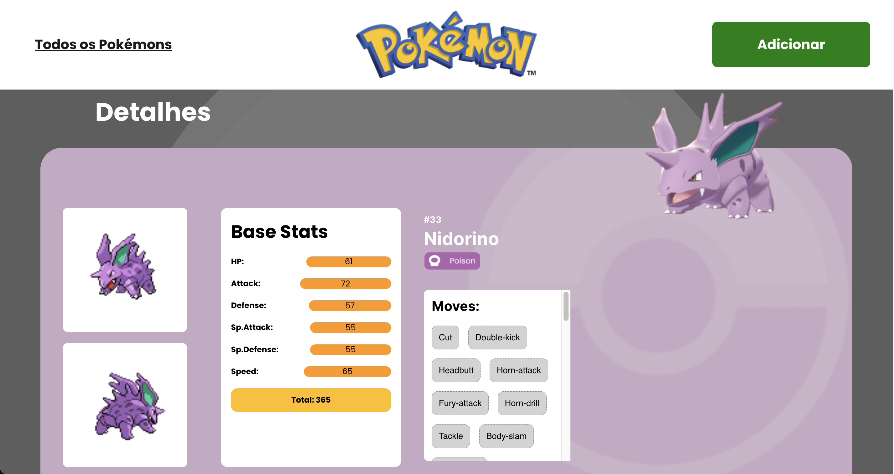
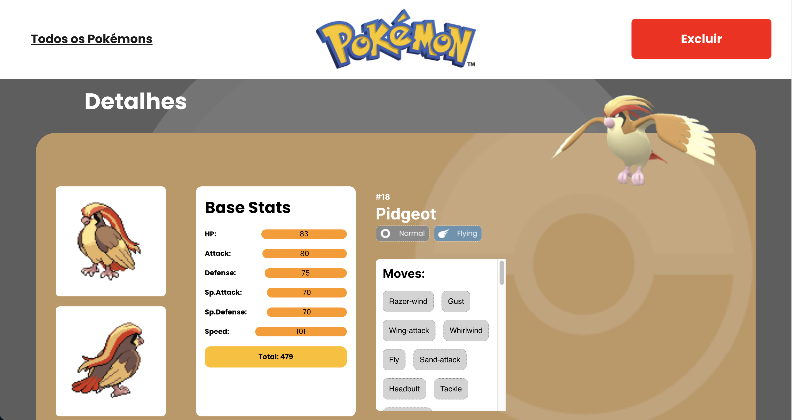

# Link do surge

https://pokedex-leonardo-canone.surge.sh

###
# **Projeto POKÉDEX - React e API's**
O Projeto POKÉDEX (React e APIs) é um site de Pokémons que possui três páginas: Home, Pokédex e Detalhes. 

O objetivo deste projeto foi criar um site com essas três páginas usando como fonte de dados para a sua criação a [Poke Api](https://pokeapi.co/ "Poke Api"), utilizando as seguintes ferramentas:

- React
- React Router
- Styled-components
- React Context
- Axios

Os principais conteúdos estudados neste projeto foram:

- Integração de APIs
- React Router
- Design Systems
- Estado Global

###
# **Requisitos gerais do projeto + Prints do projeto**
- ## **Gerais:**
	- [ ] O site deve ter 3 páginas: Home, Pokédex e Detalhes;
	- [ ] Projeto deve seguir o [design](https://www.figma.com/file/KseyA2Ofghiek2Cy3ZaDre/Poked%C3%A9x?t=AEi3zEmWmarf1FbP-0 "design") proposto;
	- [ ] O fluxo de trocas de páginas devem ser semelhante ao [fluxograma](https://www.figma.com/proto/KseyA2Ofghiek2Cy3ZaDre/Poked%C3%A9x?page-id=0%3A1&node-id=2%3A2&viewport=358%2C197%2C0.27&scaling=scale-down&starting-point-node-id=2%3A2 "fluxograma");

###
- ## **Página Home:**
	- [ ]  Mostrar uma lista de Pokemons, contendo ao menos 20 Pokemons;
	- [ ] Cada Pokemon será representado por um Card;
	- [ ] Em cada card de Pokemon tem um botão para adicioná-lo à Pokédex e um outro botão para acessar os detalhes do Pokemon;
	- [ ] Header dessa página terá um botão para acessar a página da Pokédex

	### Desktop - Homepage
	
	
	### Desktop - Mensagem de Captura
	

	### Tablet Grande
	

	### Tablet Convencional
	

	### Smartphone
	

###
- ## **Página Pokédex**
	- [ ] Renderizar a lista de pokémons adicionados na Pokédex;
	- [ ] Em cada card de Pokemon deve ter um botão para removê-lo da Pokédex e um outro botão para acessar os detalhes do Pokemon.
	- [ ] Header deve ter um botão para voltar para a Home
	- [ ] Não deve ser possível adicionar o mesmo Pokemon duas vezes na Pokédex

	### Desktop - Pokédex Page
	

	### Desktop - Mensagem de Exclusão
	

###
- ## **Página de Detalhes**
	- [ ] Mostrar os detalhes do Pokemon selecionado, com informações descritas
	- [ ] Header deve ter um botão para adicionar ou remover da Pokédex e outro para voltar a página home.
	- [ ] [Criar um readme](https://www.youtube.com/watch?v=1QKwP0SJK-c "Crie um readme") para o projeto;

	### Página de detalhes com botão Adicionar
	

	### Página de detalhes com botão Excluir
	

